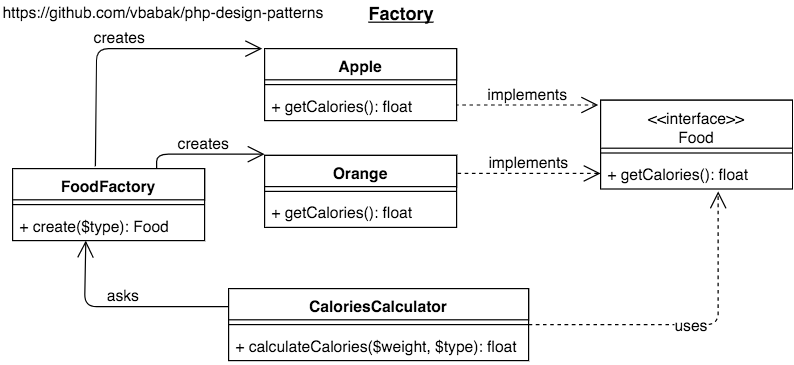

Factory
========================

## Intent

Create objects without exposing the creation logic to the client 
and refer to newly created object using a common interface

## Implementation

[PHP Implementation of Factory](Factory.php)

