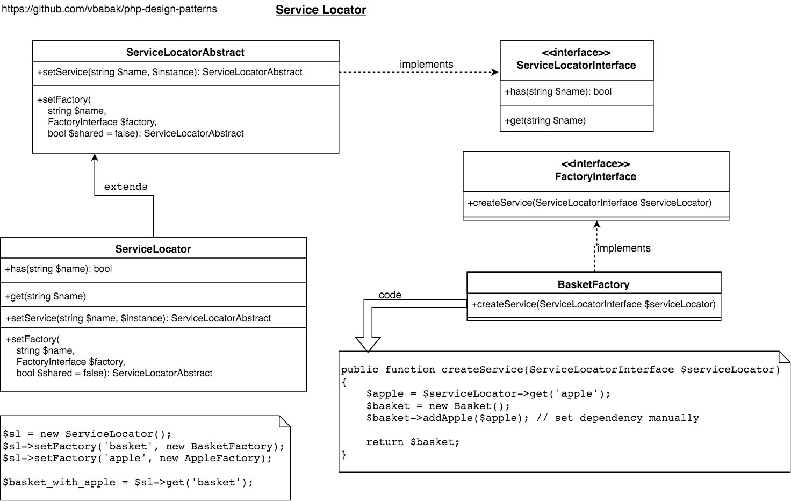

Service Locator
========================

## Intent

Locate requested services. 
Create services instances in convenient way by providing service factories.
With using Service Locator pattern normally you set required dependencies inside service factories.

## Implementation

[PHP Implementation of Service Locator](ServiceLocator.php)