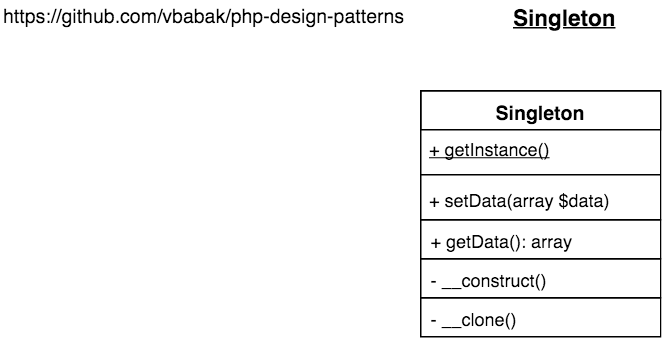

Singleton
========================

## Intent

Allow creation only one instance. 

Also it is not recommended to use Singleton design pattern everywhere 
as it creates links to the particular class.

## Implementation

[PHP Implementation of Singleton](Singleton.php)