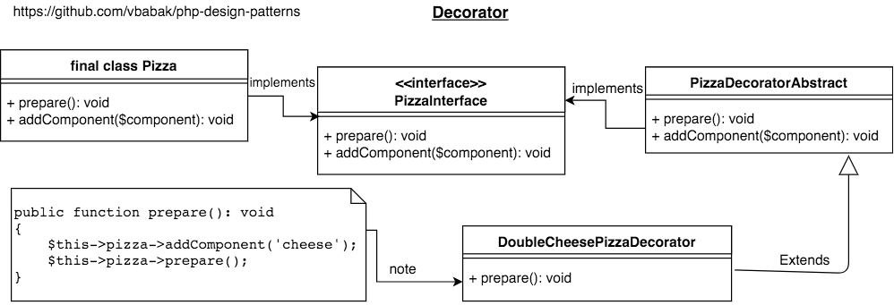

Decorator
========================

## Intent

Attach additional responsibilities to an object dynamically. Decorators provide a
flexible alternative to subclassing for extending functionality.

## Implementation

[PHP Implementation of Decorator](Decorator.php)